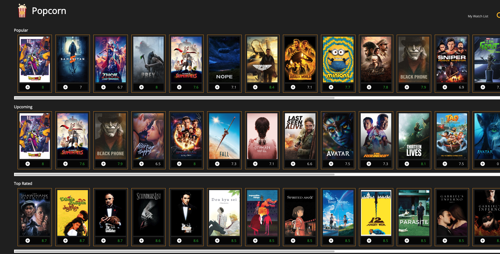

# Popcorn Movie App

## 1. Link and Preview

Project link is available at [Popcorn Movie App](https://popcorn-cinemas.netlify.app)



## 2. Description

Popcorn is a movie search application. Users can search for movies and add movies to their watch list.

## 3. Application Folder Structure

```text
public
└── index.html
src
└── assets
└── componentCss
└── context
└── helpers
└── hooks
└── routes
└── App.css
└── App.js
└── constants.js
└── index.css
└── index.js

```

## 4. Application

- API Source: [TMDBI API](https://www.themoviedb.org/documentation/api)

## 5. Must Haves

- Users can search for movies and display poster , vote average of the movies.
- Users can see the details of a movie such as genre, movie title ,release date ,overview ,vote counts,company
- Users can add movies to their watch list.
- Users can directed to the error page if something goes wrong.

## 6. Nice to Have

- Users can see the reviews of a movie and can watch the trailer of a movie.
